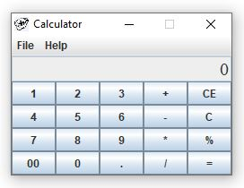
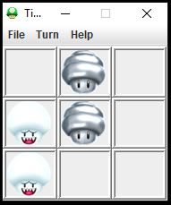
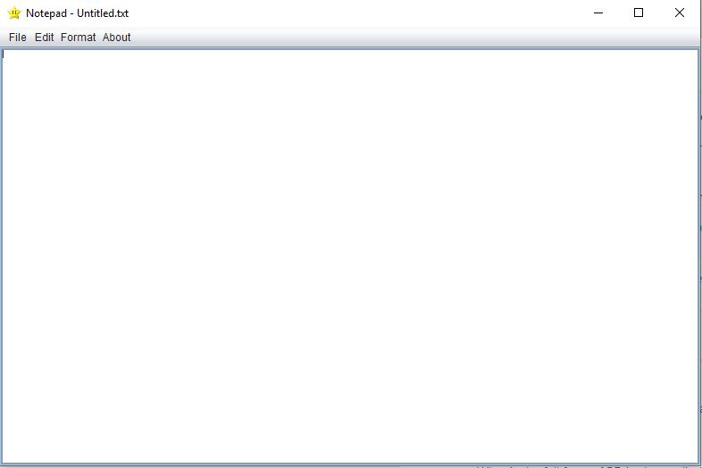

# High School Java Apps

These GUI apps were create as a hobby during my teenage. 

## Calculator
A simple calculater app.\

## Clock Widget
A widget clock for desktop.\

## Tic Tac Toe game
An application for a two player tic tac toe game.\

## Notepad
A notepad for text editting and saving encrpted messages.\

## Contributing
Pull requests are welcome.

